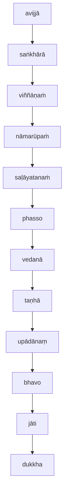

[Home](/) / [12S2 Nidānavaggasaṃyuttapāḷi](../../../12S2.md) / [1 Nidānasaṃyutta](../../1.md) / [1.1 Buddhavagga](../1.1.md)

# 𑀧𑀝𑀺𑀘𑁆𑀘𑀲𑀫𑀼𑀧𑁆𑀧𑀸𑀤𑀲𑀼𑀢𑁆𑀢 (1.1.1 Paṭiccasamuppādasutta)

* 𑀦𑀺𑀤𑀸𑀦𑀲𑀁𑀬𑀼𑀢𑁆𑀢 (Nidānasaṃyutta)

* 𑀩𑀼𑀤𑁆𑀥𑀯𑀕𑁆𑀕 (Buddhavagga)

* 𑀧𑀝𑀺𑀘𑁆𑀘𑀲𑀫𑀼𑀧𑁆𑀧𑀸𑀤𑀲𑀼𑀢𑁆𑀢 (Paṭiccasamuppādasutta)

## Summary

Paṭiccasamuppādasutta describes the concept of dependent origination, which explains how dukkha (dissatisfaction) arises from an underlying chain of causes. The cessation of these underlying causes will lead to the cessation of dukkha.

## Translation

(1.)

2\. 𑀏𑀯𑀁 𑀫𑁂 𑀲𑀼𑀢𑀁—  𑀏𑀓𑀁 𑀲𑀫𑀬𑀁 𑀪𑀕𑀯𑀸 𑀲𑀸𑀯𑀢𑁆𑀣𑀺𑀬𑀁 𑀯𑀺𑀳𑀭𑀢𑀺 𑀚𑁂𑀢𑀯𑀦𑁂 𑀅𑀦𑀸𑀣𑀧𑀺𑀡𑁆𑀟𑀺𑀓𑀲𑁆𑀲 𑀆𑀭𑀸𑀫𑁂𑁇 𑀢𑀢𑁆𑀭 𑀔𑁄 𑀪𑀕𑀯𑀸 𑀪𑀺𑀓𑁆𑀔𑀽 𑀆𑀫𑀦𑁆𑀢𑁂𑀲𑀺—  “𑀪𑀺𑀓𑁆𑀔𑀯𑁄”𑀢𑀺𑁇 “𑀪𑀤𑀦𑁆𑀢𑁂”𑀢𑀺 𑀢𑁂 𑀪𑀺𑀓𑁆𑀔𑀽 𑀪𑀕𑀯𑀢𑁄 𑀧𑀘𑁆𑀘𑀲𑁆𑀲𑁄𑀲𑀼𑀁𑁇 𑀪𑀕𑀯𑀸 𑀏𑀢𑀤𑀯𑁄𑀘—  “𑀧𑀝𑀺𑀘𑁆𑀘𑀲𑀫𑀼𑀧𑁆𑀧𑀸𑀤𑀁 𑀯𑁄, 𑀪𑀺𑀓𑁆𑀔𑀯𑁂, 𑀤𑁂𑀲𑁂𑀲𑁆𑀲𑀸𑀫𑀺𑁇 𑀢𑀁 𑀲𑀼𑀡𑀸𑀣, 𑀲𑀸𑀥𑀼𑀓𑀁 𑀫𑀦𑀲𑀺 𑀓𑀭𑁄𑀣, 𑀪𑀸𑀲𑀺𑀲𑁆𑀲𑀸𑀫𑀻”𑀢𑀺𑁇 “𑀏𑀯𑀁, 𑀪𑀦𑁆𑀢𑁂”𑀢𑀺 𑀔𑁄 𑀢𑁂 𑀪𑀺𑀓𑁆𑀔𑀽 𑀪𑀕𑀯𑀢𑁄 𑀧𑀘𑁆𑀘𑀲𑁆𑀲𑁄𑀲𑀼𑀁𑁇 𑀪𑀕𑀯𑀸 𑀏𑀢𑀤𑀯𑁄𑀘—

>Thus heard by me: At one time the Bhagava was living in Sāvatthi, in Jeta's Grove, Anāthapiṇḍika's monastery. There the Bhagava addressed the bhikkhus.
>
>“Bhikkhavo!”
>
>“Bhadante!” the bhikkhus replied to the Bhagava.
>
>The Bhagava said:  “Bhikkhave, I will teach you paṭiccasamuppāda (dependent origination). Listen to it, pay attention carefully, I will speak.” 
>
>“Yes, Bhadante” those bhikkhus replied to the Bhagava. The Bhagava said:

3\. “𑀓𑀢𑀫𑁄 𑀘, 𑀪𑀺𑀓𑁆𑀔𑀯𑁂, 𑀧𑀝𑀺𑀘𑁆𑀘𑀲𑀫𑀼𑀧𑁆𑀧𑀸𑀤𑁄? 𑀅𑀯𑀺𑀚𑁆𑀚𑀸𑀧𑀘𑁆𑀘𑀬𑀸, 𑀪𑀺𑀓𑁆𑀔𑀯𑁂, 𑀲𑀗𑁆𑀔𑀸𑀭𑀸; 𑀲𑀗𑁆𑀔𑀸𑀭𑀧𑀘𑁆𑀘𑀬𑀸 𑀯𑀺𑀜𑁆𑀜𑀸𑀡𑀁; 𑀯𑀺𑀜𑁆𑀜𑀸𑀡𑀧𑀘𑁆𑀘𑀬𑀸 𑀦𑀸𑀫𑀭𑀽𑀧𑀁; 𑀦𑀸𑀫𑀭𑀽𑀧𑀧𑀘𑁆𑀘𑀬𑀸 𑀲𑀍𑀆𑀬𑀢𑀦𑀁; 𑀲𑀍𑀆𑀬𑀢𑀦𑀧𑀘𑁆𑀘𑀬𑀸 𑀨𑀲𑁆𑀲𑁄; 𑀨𑀲𑁆𑀲𑀧𑀘𑁆𑀘𑀬𑀸 𑀯𑁂𑀤𑀦𑀸; 𑀯𑁂𑀤𑀦𑀸𑀧𑀘𑁆𑀘𑀬𑀸 𑀢𑀡𑁆𑀳𑀸; 𑀢𑀡𑁆𑀳𑀸𑀧𑀘𑁆𑀘𑀬𑀸 𑀉𑀧𑀸𑀤𑀸𑀦𑀁; 𑀉𑀧𑀸𑀤𑀸𑀦𑀧𑀘𑁆𑀘𑀬𑀸 𑀪𑀯𑁄; 𑀪𑀯𑀧𑀘𑁆𑀘𑀬𑀸 𑀚𑀸𑀢𑀺; 𑀚𑀸𑀢𑀺𑀧𑀘𑁆𑀘𑀬𑀸 𑀚𑀭𑀸𑀫𑀭𑀡𑀁 𑀲𑁄𑀓𑀧𑀭𑀺𑀤𑁂𑀯𑀤𑀼𑀓𑁆𑀔𑀤𑁄𑀫𑀦𑀲𑁆𑀲𑀼𑀧𑀸𑀬𑀸𑀲𑀸 𑀲𑀫𑁆𑀪𑀯𑀦𑁆𑀢𑀺𑁇 𑀏𑀯𑀫𑁂𑀢𑀲𑁆𑀲 𑀓𑁂𑀯𑀮𑀲𑁆𑀲 𑀤𑀼𑀓𑁆𑀔𑀓𑁆𑀔𑀦𑁆𑀥𑀲𑁆𑀲 𑀲𑀫𑀼𑀤𑀬𑁄 𑀳𑁄𑀢𑀺𑁇 𑀅𑀬𑀁 𑀯𑀼𑀘𑁆𑀘𑀢𑀺, 𑀪𑀺𑀓𑁆𑀔𑀯𑁂, 𑀧𑀝𑀺𑀘𑁆𑀘𑀲𑀫𑀼𑀧𑁆𑀧𑀸𑀤𑁄𑁇

> “And what, bhikkhave, is paṭiccasamuppāda?
>
> * with avijjā (ignorance) as cause, bhikkhave, saṅkhārā (mental constructions) arise;
> * with saṅkhārā as cause, viññāṇaṁ (consciousness) arise;
> * with viññāṇaṁ as cause, nāmarūpaṁ (literally "identity and form" - our bodies and sense of identity, or "I" vs "not I") arise;
> * with nāmarūpaṁ as cause, saḷāyatanaṁ (our perceptions of stimuli through the six senses) arise;
> * with saḷāyatanaṁ as cause, phasso ("contact", or cognisance of stimuli) arise;
> * with phasso as cause, vedanā ("reactions", or our reactions to stimuli) arise;
> * with vedanā as cause, taṇhā (cravings, desires, wants and needs) arise;
> * with taṇhā as cause, upādānaṃ (literally "fuel", or our survival instinct which drives all our attachments to material objects and emotional states) arise;
> * with upādānaṃ as cause, bhavo (our "life" or sense of being) arise;
> * with bhavo as cause, jāti (our "birth" or "existence") arise;
> * with jāti as cause, jarāmaraṇaṃ (aging and death), sorrow, lamentation, pain, displeasure, and despair arise.
>
> This is the origin of the entirety of dukkha (dissatisfaction). This, bhikkhave, is called paṭiccasamuppāda."

4\. 𑀅𑀯𑀺𑀚𑁆𑀚𑀸𑀬 𑀢𑁆𑀯𑁂𑀯 𑀅𑀲𑁂𑀲𑀯𑀺𑀭𑀸𑀕𑀦𑀺𑀭𑁄𑀥𑀸 𑀲𑀗𑁆𑀔𑀸𑀭𑀦𑀺𑀭𑁄𑀥𑁄; 𑀲𑀗𑁆𑀔𑀸𑀭𑀦𑀺𑀭𑁄𑀥𑀸 𑀯𑀺𑀜𑁆𑀜𑀸𑀡𑀦𑀺𑀭𑁄𑀥𑁄; 𑀯𑀺𑀜𑁆𑀜𑀸𑀡𑀦𑀺𑀭𑁄𑀥𑀸 𑀦𑀸𑀫𑀭𑀽𑀧𑀦𑀺𑀭𑁄𑀥𑁄; 𑀦𑀸𑀫𑀭𑀽𑀧𑀦𑀺𑀭𑁄𑀥𑀸 𑀲𑀍𑀆𑀬𑀢𑀦𑀦𑀺𑀭𑁄𑀥𑁄; 𑀲𑀍𑀆𑀬𑀢𑀦𑀦𑀺𑀭𑁄𑀥𑀸 𑀨𑀲𑁆𑀲𑀦𑀺𑀭𑁄𑀥𑁄; 𑀨𑀲𑁆𑀲𑀦𑀺𑀭𑁄𑀥𑀸 𑀯𑁂𑀤𑀦𑀸𑀦𑀺𑀭𑁄𑀥𑁄; 𑀯𑁂𑀤𑀦𑀸𑀦𑀺𑀭𑁄𑀥𑀸 𑀢𑀡𑁆𑀳𑀸𑀦𑀺𑀭𑁄𑀥𑁄; 𑀢𑀡𑁆𑀳𑀸𑀦𑀺𑀭𑁄𑀥𑀸 𑀉𑀧𑀸𑀤𑀸𑀦𑀦𑀺𑀭𑁄𑀥𑁄; 𑀉𑀧𑀸𑀤𑀸𑀦𑀦𑀺𑀭𑁄𑀥𑀸 𑀪𑀯𑀦𑀺𑀭𑁄𑀥𑁄; 𑀪𑀯𑀦𑀺𑀭𑁄𑀥𑀸 𑀚𑀸𑀢𑀺𑀦𑀺𑀭𑁄𑀥𑁄; 𑀚𑀸𑀢𑀺𑀦𑀺𑀭𑁄𑀥𑀸 𑀚𑀭𑀸𑀫𑀭𑀡𑀁 𑀲𑁄𑀓𑀧𑀭𑀺𑀤𑁂𑀯𑀤𑀼𑀓𑁆𑀔𑀤𑁄𑀫𑀦𑀲𑁆𑀲𑀼𑀧𑀸𑀬𑀸𑀲𑀸 𑀦𑀺𑀭𑀼𑀚𑁆𑀛𑀦𑁆𑀢𑀺𑁇 𑀏𑀯𑀫𑁂𑀢𑀲𑁆𑀲 𑀓𑁂𑀯𑀮𑀲𑁆𑀲 𑀤𑀼𑀓𑁆𑀔𑀓𑁆𑀔𑀦𑁆𑀥𑀲𑁆𑀲 𑀦𑀺𑀭𑁄𑀥𑁄 𑀳𑁄𑀢𑀻”𑀢𑀺𑁇 𑀇𑀤𑀫𑀯𑁄𑀘 𑀪𑀕𑀯𑀸𑁇 𑀅𑀢𑁆𑀢𑀫𑀦𑀸 𑀢𑁂 𑀪𑀺𑀓𑁆𑀔𑀽 𑀪𑀕𑀯𑀢𑁄 𑀪𑀸𑀲𑀺𑀢𑀁 𑀅𑀪𑀺𑀦𑀦𑁆𑀤𑀼𑀦𑁆𑀢𑀺𑁇

>"But
>
> * with the complete cessation of avijjā, the cessation of saṅkhārā;
> * with the cessation of saṅkhārā, the cessation of viññāṇaṁ;
> * with the cessation of viññāṇaṁ, the cessation of nāmarūpaṁ;
> * with the cessation of nāmarūpaṁ, the cessation of the saḷāyatanaṁ;
> * with the cessation of saḷāyatanaṁ, the cessation of phasso;
> * with the cessation of phasso, the cessation of vedanā;
> * with the cessation of vedanā, the cessation of taṇhā;
> * with the cessation of taṇhā, the cessation of upādānaṃ;
> * with the cessation of upādānaṃ, the cessation of bhavo;
> * with the cessation of bhavo, the cessation of birth;
> * with the cessation of jāti, aging and death, sorrow, lamentation, pain, displeasure, and despair cease.
>
> This, bhikkhus, is the cessation of the entirety of dukkha.”
>
>The Bhagava said this. Those bhikkhus were satisfied and delighted in the Bhagava's words.

---

5\. 𑀧𑀞𑀫𑀁𑁇 (First)

## Commentary

Paṭiccasamuppādasutta, allegedly the thought process that led to the Buddha's realisation, is the central thesis and core of the Buddha's teachings and basis for the soteriology.

The Buddha believed that our viññāṇaṁ (consciousness and sense of "identity" or "self") is "constructed" and ephemeral, and based on the aggregation of saṅkhārā (mental constructions). Furthermore, we are unaware or ignorant of the "constructed" or artificial nature of our consciousness, and hence avijjā (ignorance) is the starting point of Paṭiccasamuppādasutta.

What are mental constructions? These are aggregations of our past experiences, mental states, ideas, thoughts, perceptions, biases, prejudices, everything that make up our "personality" and sense of identity.

Our ignorance of the ephemeral nature of our consciousness is what ultimately leads to dukkha, which is a general dissatisfaction and unease regarding the nature of our existence. We crave for what we cannot have, permanence, comfort and stability but our sense of "self" is impermanent, perennially uncomfortable and unstable.

Paṭiccasamuppādasutta represents a chain of causes that form a cycle. The last component of the chain leads back to the first, and hence the cycle repeats itself ad infinitum.

Paṭiccasamuppādasutta can be modelled as a concentric set of cycles, each representing a process. The processes have increased span and duration as we move outwards from the innermost cycle to the outermost cycle. In theory there are an infinite number of these cycles, but in practice we only need to detail the most significant ones, that can be easily analysed.

The innermost cycle is the span of a single thought process, from it's arising to it's cessation. The next cycle of importance is the span of a single day, representing the arising and cessation of consciousness. After that is the cycle of a single lifetime, and beyond that is the cycle of multiple lifetimes and ultimately the cycle of the universe itself. In between are many other cycles (months, seasons, years, the life and death of stars etc.) but for the purposes of understanding we are less concerned with those.

The following table illustrates how Paṭiccasamuppādasutta works across the different cycles:

| Cause | Thought | Day | Lifetime | Multiple Lifetimes |
| --- | --- | --- | --- | --- |
| avijjā | pre thought "blankness"| awake from sleep | our birth, with no recollection of previous lives | ignorance of previous lives |
| saṅkhārā | previous thoughts | reflections from previous days | mental constructions for this lifetime | constructions are per life |
| viññāṇaṁ | "environment" or context of thought | disposition for the day | consciousness for this lifetime | multiple consciousness, no permanent self |
| nāmarūpaṁ | stimuli or trigger to a thought | daily stimuli | lifetime stimuli | each lifetime has unique identifies and forms |
| saḷāyatanaṁ | perception of stimuli | perception of stimuli | lifetime perceptions | consciousness in each lifetime shaped by unique stimuli |
| phasso | cognizance of stimuli | recognition of experiences | lifetime experiences | symbolic representations or processing of perceptions |
| vedanā | reaction to perception | reaction to experiences| reaction to experiences | transformation of symbolic representations |
| taṇhā | desire, or intention | our wants and needs for the day | lifetime goals and objectives | each lifetime has unique desires |
| upādānaṃ | willpower to execute desire | attachment to wants and needs | survival instinct | each lifetime has it's own "fuel" |
| bhavo | plan of execution | action plan for the day | lifetime path | each lifetime is a unique path or existence |
| jāti | action out of thought process | actions during the day | this existence | rebirth of beings |
| dukkha | results of action, termination of thought | results of actions, followed by sleep | dissatisfaction and death | saṃsāra, or the cycle of rebirths |

[Go to previous page (1.1 Buddhavagga)](../1.1.md) / [Go to parent page (1.1 Buddhavagga)](../1.1.md) / [Go to next page (1.1.2 Vibhaṅgasutta)](1.1.2.md)
