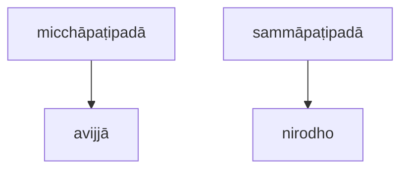

[Home](/) / [12S2 Nidānavaggasaṃyuttapāḷi](../../../12S2.md) / [1 Nidānasaṃyutta](../../1.md) / [1.1 Buddhavagga](../1.1.md)

# 𑀧𑀝𑀺𑀧𑀤𑀸𑀲𑀼𑀢𑁆𑀢 (1.1.3 Paṭipadāsutta)

* 𑀦𑀺𑀤𑀸𑀦𑀲𑀁𑀬𑀼𑀢𑁆𑀢 (Nidānasaṃyutta)

* 𑀩𑀼𑀤𑁆𑀥𑀯𑀕𑁆𑀕 (Buddhavagga)

* 𑀧𑀝𑀺𑀧𑀤𑀸𑀲𑀼𑀢𑁆𑀢 (Paṭipadāsutta)

## Summary

Paṭipadāsutta explains the difference between micchāpaṭipadā (wrong path of progress) and sammāpaṭipadā (right path of progress).

## Translation

(3.)

22\. 𑀲𑀸𑀯𑀢𑁆𑀣𑀺𑀬𑀁 𑀯𑀺𑀳𑀭𑀢𑀺…𑀧𑁂…  “𑀫𑀺𑀘𑁆𑀙𑀸𑀧𑀝𑀺𑀧𑀤𑀜𑁆𑀘 𑀯𑁄, 𑀪𑀺𑀓𑁆𑀔𑀯𑁂, 𑀤𑁂𑀲𑁂𑀲𑁆𑀲𑀸𑀫𑀺 𑀲𑀫𑁆𑀫𑀸𑀧𑀝𑀺𑀧𑀤𑀜𑁆𑀘𑁇 𑀢𑀁 𑀲𑀼𑀡𑀸𑀣, 𑀲𑀸𑀥𑀼𑀓𑀁 𑀫𑀦𑀲𑀺 𑀓𑀭𑁄𑀣, 𑀪𑀸𑀲𑀺𑀲𑁆𑀲𑀸𑀫𑀻”𑀢𑀺𑁇 “𑀏𑀯𑀁, 𑀪𑀦𑁆𑀢𑁂”𑀢𑀺 𑀔𑁄 𑀢𑁂 𑀪𑀺𑀓𑁆𑀔𑀽 𑀪𑀕𑀯𑀢𑁄 𑀧𑀘𑁆𑀘𑀲𑁆𑀲𑁄𑀲𑀼𑀁𑁇 𑀪𑀕𑀯𑀸 𑀏𑀢𑀤𑀯𑁄𑀘—

> (Whilst residing at Sāvatthi) … "I will teach you, bhikkhave, micchāpaṭipadā (wrong path of progress) and sammāpaṭipadā (right path of progress), I will analyze it. Listen, pay attention, I will speak."
>
> "Yes, Bhante," those bhikkhus replied to the Bhagava.
>
> The Bhagava said:

23\. “𑀓𑀢𑀫𑀸 𑀘, 𑀪𑀺𑀓𑁆𑀔𑀯𑁂, 𑀫𑀺𑀘𑁆𑀙𑀸𑀧𑀝𑀺𑀧𑀤𑀸? 𑀅𑀯𑀺𑀚𑁆𑀚𑀸𑀧𑀘𑁆𑀘𑀬𑀸, 𑀪𑀺𑀓𑁆𑀔𑀯𑁂, 𑀲𑀗𑁆𑀔𑀸𑀭𑀸; 𑀲𑀗𑁆𑀔𑀸𑀭𑀧𑀘𑁆𑀘𑀬𑀸 𑀯𑀺𑀜𑁆𑀜𑀸𑀡𑀁…𑀧𑁂…  𑀏𑀯𑀫𑁂𑀢𑀲𑁆𑀲 𑀓𑁂𑀯𑀮𑀲𑁆𑀲 𑀤𑀼𑀓𑁆𑀔𑀓𑁆𑀔𑀦𑁆𑀥𑀲𑁆𑀲 𑀲𑀫𑀼𑀤𑀬𑁄 𑀳𑁄𑀢𑀺𑁇 𑀅𑀬𑀁 𑀯𑀼𑀘𑁆𑀘𑀢𑀺, 𑀪𑀺𑀓𑁆𑀔𑀯𑁂, 𑀫𑀺𑀘𑁆𑀙𑀸𑀧𑀝𑀺𑀧𑀤𑀸𑁇

> “What, bhikkhave, is micchāpaṭipadā? Due to avijjā (ignorance), bhikkhave, saṅkhārā (mental constructions); due to saṅkhārā, viññāṇaṁ (consciousness) …  thus there is the arising of this entirety of dukkha (dissatisfaction). This, bhikkhave, is called micchāpaṭipadā.

24\. 𑀓𑀢𑀫𑀸 𑀘, 𑀪𑀺𑀓𑁆𑀔𑀯𑁂, 𑀲𑀫𑁆𑀫𑀸𑀧𑀝𑀺𑀧𑀤𑀸? 𑀅𑀯𑀺𑀚𑁆𑀚𑀸𑀬 𑀢𑁆𑀯𑁂𑀯 𑀅𑀲𑁂𑀲𑀯𑀺𑀭𑀸𑀕𑀦𑀺𑀭𑁄𑀥𑀸 𑀲𑀗𑁆𑀔𑀸𑀭𑀦𑀺𑀭𑁄𑀥𑁄; 𑀲𑀗𑁆𑀔𑀸𑀭𑀦𑀺𑀭𑁄𑀥𑀸 𑀯𑀺𑀜𑁆𑀜𑀸𑀡𑀦𑀺𑀭𑁄𑀥𑁄…𑀧𑁂…  𑀏𑀯𑀫𑁂𑀢𑀲𑁆𑀲 𑀓𑁂𑀯𑀮𑀲𑁆𑀲 𑀤𑀼𑀓𑁆𑀔𑀓𑁆𑀔𑀦𑁆𑀥𑀲𑁆𑀲 𑀦𑀺𑀭𑁄𑀥𑁄 𑀳𑁄𑀢𑀺𑁇 𑀅𑀬𑀁 𑀯𑀼𑀘𑁆𑀘𑀢𑀺, 𑀪𑀺𑀓𑁆𑀔𑀯𑁂, 𑀲𑀫𑁆𑀫𑀸𑀧𑀝𑀺𑀧𑀤𑀸”𑀢𑀺𑁇

> What, bhikkhave, is sammāpaṭipadā? Due to nirodho (cessation) of avijjā, (there is) the cessation of saṅkhārā; due to the cessation of saṅkhārā, the cessation of viññāṇaṁ …  thus there is the cessation of this entirety of dukkha. This, bhikkhave, is called sammāpaṭipadā.”

## Commentary

This sutta describes micchāpaṭipadā as doing nothing, carrying on with our lives and allowing our avijjā to lead to dukkha. sammāpaṭipadā, on the other hand, is striving for the cessation of the underlying causes of dukkha.

---

25\. 𑀢𑀢𑀺𑀬𑀁𑁇 (Third)

[Go to previous page (1.1.2 Vibhaṅgasutta)](1.1.2.md) / [Go to parent page (1.1 Buddhavagga)](../1.1.md) / [Go to next page (1.1.4 Vipassīsutta)](1.1.4.md)
