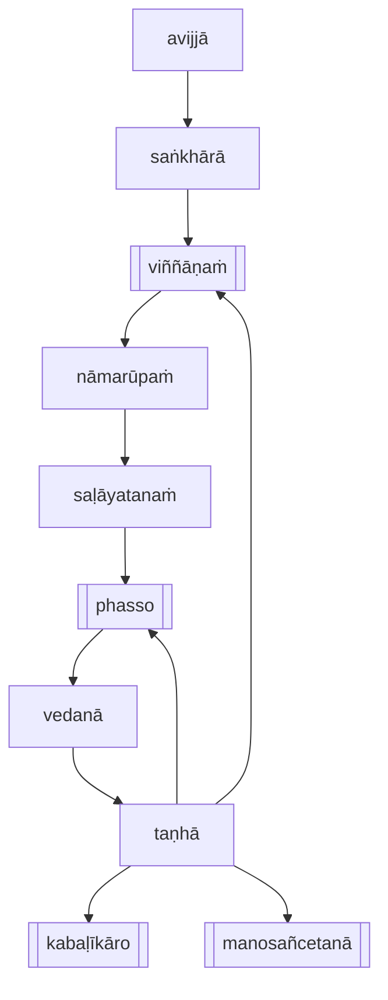

[Home](/) / [12S2 Nidānavaggasaṃyuttapāḷi](../../../12S2.md) / [1 Nidānasaṃyutta](../../1.md) / [1.2 Āhāravagga](../1.2.md)

# 𑀆𑀳𑀸𑀭𑀲𑀼𑀢𑁆𑀢 (1.2.1 Āhārasutta)

* 𑀦𑀺𑀤𑀸𑀦𑀲𑀁𑀬𑀼𑀢𑁆𑀢 (Nidānasaṃyutta)

* 𑀆𑀳𑀸𑀭𑀯𑀕𑁆𑀕 (Āhāravagga)

* 𑀆𑀳𑀸𑀭𑀲𑀼𑀢𑁆𑀢 (Āhārasutta)

## Summary

Āhārasutta explains the four āhārā (nutriments) that sustain beings: kabaḷīkāro (food, or edible nutrient), phasso (contact, or experience of stimuli), manosañcetanā (mental volition, or intention), and viññāṇaṃ (consciousness). It describes how the need for these nutriments are caused by paṭiccasamuppāda (dependent origination). The cessation of these underlying causes will lead to the cessation of āhārā.

## Translation

(11.)

68\. 𑀏𑀯𑀁 𑀫𑁂 𑀲𑀼𑀢𑀁—  𑀏𑀓𑀁 𑀲𑀫𑀬𑀁 𑀪𑀕𑀯𑀸 𑀲𑀸𑀯𑀢𑁆𑀣𑀺𑀬𑀁 𑀯𑀺𑀳𑀭𑀢𑀺 𑀚𑁂𑀢𑀯𑀦𑁂 𑀅𑀦𑀸𑀣𑀧𑀺𑀡𑁆𑀟𑀺𑀓𑀲𑁆𑀲 𑀆𑀭𑀸𑀫𑁂…  “𑀘𑀢𑁆𑀢𑀸𑀭𑁄𑀫𑁂, 𑀪𑀺𑀓𑁆𑀔𑀯𑁂, 𑀆𑀳𑀸𑀭𑀸 𑀪𑀽𑀢𑀸𑀦𑀁 𑀯𑀸 𑀲𑀢𑁆𑀢𑀸𑀦𑀁 𑀞𑀺𑀢𑀺𑀬𑀸 𑀲𑀫𑁆𑀪𑀯𑁂𑀲𑀻𑀦𑀁 𑀯𑀸 𑀅𑀦𑀼𑀕𑁆𑀕𑀳𑀸𑀬𑁇 𑀓𑀢𑀫𑁂 𑀘𑀢𑁆𑀢𑀸𑀭𑁄? 𑀓𑀩𑀍𑀈𑀓𑀸𑀭𑁄 𑀆𑀳𑀸𑀭𑁄—  𑀑𑀍𑀆𑀭𑀺𑀓𑁄 𑀯𑀸 𑀲𑀼𑀔𑀼𑀫𑁄 𑀯𑀸, 𑀨𑀲𑁆𑀲𑁄 𑀤𑀼𑀢𑀺𑀬𑁄, 𑀫𑀦𑁄𑀲𑀜𑁆𑀘𑁂𑀢𑀦𑀸 𑀢𑀢𑀺𑀬𑀸, 𑀯𑀺𑀜𑁆𑀜𑀸𑀡𑀁 𑀘𑀢𑀼𑀢𑁆𑀣𑀁𑁇 𑀇𑀫𑁂 𑀔𑁄, 𑀪𑀺𑀓𑁆𑀔𑀯𑁂, 𑀘𑀢𑁆𑀢𑀸𑀭𑁄 𑀆𑀳𑀸𑀭𑀸 𑀪𑀽𑀢𑀸𑀦𑀁 𑀯𑀸 𑀲𑀢𑁆𑀢𑀸𑀦𑀁 𑀞𑀺𑀢𑀺𑀬𑀸 𑀲𑀫𑁆𑀪𑀯𑁂𑀲𑀻𑀦𑀁 𑀯𑀸 𑀅𑀦𑀼𑀕𑁆𑀕𑀳𑀸𑀬𑁇

> Thus heard by me: At one time the Bhagava was living in Sāvatthi, in Jeta's Grove, Anāthapiṇḍika's monastery ...
>
> “There are, bhikkhave, these four āhārā (nutriments) for the maintenance of beings or for the support of those who are to be born. What four?:
>
> * kabaḷīkāro (food, or edible nutriment), oḷāriko (coarse) or sukhumo (fine),
> * phasso (contact, or experience of stimuli) is the second,
> * manosañcetanā (intention, or mental volition) is the third,
> * viññāṇaṃ (consciousness) is the fourth.
>
> These, bhikkhave, are the four āhārā for the maintenance of beings or for the support of those who are to be born.

69\. 𑀇𑀫𑁂, 𑀪𑀺𑀓𑁆𑀔𑀯𑁂, 𑀘𑀢𑁆𑀢𑀸𑀭𑁄 𑀆𑀳𑀸𑀭𑀸 𑀓𑀺𑀁𑀦𑀺𑀤𑀸𑀦𑀸 𑀓𑀺𑀁𑀲𑀫𑀼𑀤𑀬𑀸 𑀓𑀺𑀁𑀚𑀸𑀢𑀺𑀓𑀸 𑀓𑀺𑀁𑀧𑀪𑀯𑀸? 𑀇𑀫𑁂 𑀘𑀢𑁆𑀢𑀸𑀭𑁄 𑀆𑀳𑀸𑀭𑀸 𑀢𑀡𑁆𑀳𑀸𑀦𑀺𑀤𑀸𑀦𑀸 𑀢𑀡𑁆𑀳𑀸𑀲𑀫𑀼𑀤𑀬𑀸 𑀢𑀡𑁆𑀳𑀸𑀚𑀸𑀢𑀺𑀓𑀸 𑀢𑀡𑁆𑀳𑀸𑀧𑀪𑀯𑀸𑁇 𑀢𑀡𑁆𑀳𑀸 𑀘𑀸𑀬𑀁, 𑀪𑀺𑀓𑁆𑀔𑀯𑁂, 𑀓𑀺𑀁𑀦𑀺𑀤𑀸𑀦𑀸 𑀓𑀺𑀁𑀲𑀫𑀼𑀤𑀬𑀸 𑀓𑀺𑀁𑀚𑀸𑀢𑀺𑀓𑀸 𑀓𑀺𑀁𑀧𑀪𑀯𑀸? 𑀢𑀡𑁆𑀳𑀸 𑀯𑁂𑀤𑀦𑀸𑀦𑀺𑀤𑀸𑀦𑀸 𑀯𑁂𑀤𑀦𑀸𑀲𑀫𑀼𑀤𑀬𑀸 𑀯𑁂𑀤𑀦𑀸𑀚𑀸𑀢𑀺𑀓𑀸 𑀯𑁂𑀤𑀦𑀸𑀧𑀪𑀯𑀸𑁇 𑀯𑁂𑀤𑀦𑀸 𑀘𑀸𑀬𑀁, 𑀪𑀺𑀓𑁆𑀔𑀯𑁂, 𑀓𑀺𑀁𑀦𑀺𑀤𑀸𑀦𑀸 𑀓𑀺𑀁𑀲𑀫𑀼𑀤𑀬𑀸 𑀓𑀺𑀁𑀚𑀸𑀢𑀺𑀓𑀸 𑀓𑀺𑀁𑀧𑀪𑀯𑀸? 𑀯𑁂𑀤𑀦𑀸 𑀨𑀲𑁆𑀲𑀦𑀺𑀤𑀸𑀦𑀸 𑀨𑀲𑁆𑀲𑀲𑀫𑀼𑀤𑀬𑀸 𑀨𑀲𑁆𑀲𑀚𑀸𑀢𑀺𑀓𑀸 𑀨𑀲𑁆𑀲𑀧𑀪𑀯𑀸𑁇 𑀨𑀲𑁆𑀲𑁄 𑀘𑀸𑀬𑀁, 𑀪𑀺𑀓𑁆𑀔𑀯𑁂, 𑀓𑀺𑀁𑀦𑀺𑀤𑀸𑀦𑁄 𑀓𑀺𑀁𑀲𑀫𑀼𑀤𑀬𑁄 𑀓𑀺𑀁𑀚𑀸𑀢𑀺𑀓𑁄 𑀓𑀺𑀁𑀧𑀪𑀯𑁄? 𑀨𑀲𑁆𑀲𑁄 𑀲𑀍𑀆𑀬𑀢𑀦𑀦𑀺𑀤𑀸𑀦𑁄 𑀲𑀍𑀆𑀬𑀢𑀦𑀲𑀫𑀼𑀤𑀬𑁄 𑀲𑀍𑀆𑀬𑀢𑀦𑀚𑀸𑀢𑀺𑀓𑁄 𑀲𑀍𑀆𑀬𑀢𑀦𑀧𑀪𑀯𑁄𑁇 𑀲𑀍𑀆𑀬𑀢𑀦𑀜𑁆𑀘𑀺𑀤𑀁, 𑀪𑀺𑀓𑁆𑀔𑀯𑁂, 𑀓𑀺𑀁𑀦𑀺𑀤𑀸𑀦𑀁 𑀓𑀺𑀁𑀲𑀫𑀼𑀤𑀬𑀁 𑀓𑀺𑀁𑀚𑀸𑀢𑀺𑀓𑀁 𑀓𑀺𑀁𑀧𑀪𑀯𑀁? 𑀲𑀍𑀆𑀬𑀢𑀦𑀁 𑀦𑀸𑀫𑀭𑀽𑀧𑀦𑀺𑀤𑀸𑀦𑀁 𑀦𑀸𑀫𑀭𑀽𑀧𑀲𑀫𑀼𑀤𑀬𑀁 𑀦𑀸𑀫𑀭𑀽𑀧𑀚𑀸𑀢𑀺𑀓𑀁 𑀦𑀸𑀫𑀭𑀽𑀧𑀧𑀪𑀯𑀁𑁇 𑀦𑀸𑀫𑀭𑀽𑀧𑀜𑁆𑀘𑀺𑀤𑀁, 𑀪𑀺𑀓𑁆𑀔𑀯𑁂, 𑀓𑀺𑀁𑀦𑀺𑀤𑀸𑀦𑀁 𑀓𑀺𑀁𑀲𑀫𑀼𑀤𑀬𑀁 𑀓𑀺𑀁𑀚𑀸𑀢𑀺𑀓𑀁 𑀓𑀺𑀁𑀧𑀪𑀯𑀁? 𑀦𑀸𑀫𑀭𑀽𑀧𑀁 𑀯𑀺𑀜𑁆𑀜𑀸𑀡𑀦𑀺𑀤𑀸𑀦𑀁 𑀯𑀺𑀜𑁆𑀜𑀸𑀡𑀲𑀫𑀼𑀤𑀬𑀁 𑀯𑀺𑀜𑁆𑀜𑀸𑀡𑀚𑀸𑀢𑀺𑀓𑀁 𑀯𑀺𑀜𑁆𑀜𑀸𑀡𑀧𑀪𑀯𑀁𑁇 𑀯𑀺𑀜𑁆𑀜𑀸𑀡𑀜𑁆𑀘𑀺𑀤𑀁, 𑀪𑀺𑀓𑁆𑀔𑀯𑁂, 𑀓𑀺𑀁𑀦𑀺𑀤𑀸𑀦𑀁 𑀓𑀺𑀁𑀲𑀫𑀼𑀤𑀬𑀁 𑀓𑀺𑀁𑀚𑀸𑀢𑀺𑀓𑀁 𑀓𑀺𑀁𑀧𑀪𑀯𑀁? 𑀯𑀺𑀜𑁆𑀜𑀸𑀡𑀁 𑀲𑀗𑁆𑀔𑀸𑀭𑀦𑀺𑀤𑀸𑀦𑀁 𑀲𑀗𑁆𑀔𑀸𑀭𑀲𑀫𑀼𑀤𑀬𑀁 𑀲𑀗𑁆𑀔𑀸𑀭𑀚𑀸𑀢𑀺𑀓𑀁 𑀲𑀗𑁆𑀔𑀸𑀭𑀧𑀪𑀯𑀁𑁇 𑀲𑀗𑁆𑀔𑀸𑀭𑀸 𑀘𑀺𑀫𑁂, 𑀪𑀺𑀓𑁆𑀔𑀯𑁂, 𑀓𑀺𑀁𑀦𑀺𑀤𑀸𑀦𑀸 𑀓𑀺𑀁𑀲𑀫𑀼𑀤𑀬𑀸 𑀓𑀺𑀁𑀚𑀸𑀢𑀺𑀓𑀸 𑀓𑀺𑀁𑀧𑀪𑀯𑀸? 𑀲𑀗𑁆𑀔𑀸𑀭𑀸 𑀅𑀯𑀺𑀚𑁆𑀚𑀸𑀦𑀺𑀤𑀸𑀦𑀸 𑀅𑀯𑀺𑀚𑁆𑀚𑀸𑀲𑀫𑀼𑀤𑀬𑀸 𑀅𑀯𑀺𑀚𑁆𑀚𑀸𑀚𑀸𑀢𑀺𑀓𑀸 𑀅𑀯𑀺𑀚𑁆𑀚𑀸𑀧𑀪𑀯𑀸𑁇

> These, bhikkhave, four nutriments:
>
> * what is their origin,
> * what is their source,
> * what is their birth,
> * what is their cause?
>
> These four nutriments have taṇhā (craving) as their origin, taṇhā as their source, taṇhā as their birth, taṇhā as their cause. And this taṇhā, bhikkhave, what is its origin, what is its source, what is its birth, what is its cause? taṇhā has vedanā (feeling) as its origin, vedanā as its source, vedanā as its birth, vedanā as its cause.
>
> And this vedanā, bhikkhave, what is its origin, what is its source, what is its birth, what is its cause? vedanā has phasso (contact, or experience of stimuli) as its origin, phasso as its source, phasso as its birth, phasso as its cause.
>
> And this phasso, bhikkhave, what is its origin, what is its source, what is its birth, what is its cause? phasso has the saḷāyatanaṃ (six senses, or stimuli) as its origin, the saḷāyatanaṃ as its source, the saḷāyatanaṃ as its birth, the saḷāyatanaṃ as its cause.
>
> And this saḷāyatanaṃ, bhikkhave, what is its origin, what is its source, what is its birth, what is its cause? The saḷāyatanaṃ has nāmarūpaṃ (identity and form) as its origin, nāmarūpaṃ as its source, nāmarūpaṃ as its birth, nāmarūpaṃ as its cause.
>
> And this nāmarūpaṃ, bhikkhave, what is its origin, what is its source, what is its birth, what is its cause? nāmarūpaṃ has viññāṇaṃ (consciousness) as its origin, viññāṇaṃ as its source, viññāṇaṃ as its birth, viññāṇaṃ as its cause.
>
> And this viññāṇaṃ, bhikkhave, what is its origin, what is its source, what is its birth, what is its cause? viññāṇaṃ has saṅkhārā (mental constructions) as its origin, saṅkhārā as its source, saṅkhārā as its birth, saṅkhārā as its cause.
>
> And these saṅkhārā, bhikkhave, what is their origin, what is their source, what is their birth, what is their cause? saṅkhārā have avijjā as their origin, avijjā as their source, avijjā as their birth, avijjā as their cause.

70\. 𑀇𑀢𑀺 𑀔𑁄, 𑀪𑀺𑀓𑁆𑀔𑀯𑁂, 𑀅𑀯𑀺𑀚𑁆𑀚𑀸𑀧𑀘𑁆𑀘𑀬𑀸 𑀲𑀗𑁆𑀔𑀸𑀭𑀸; 𑀲𑀗𑁆𑀔𑀸𑀭𑀧𑀘𑁆𑀘𑀬𑀸 𑀯𑀺𑀜𑁆𑀜𑀸𑀡𑀁…𑀧𑁂…  𑀏𑀯𑀫𑁂𑀢𑀲𑁆𑀲 𑀓𑁂𑀯𑀮𑀲𑁆𑀲 𑀤𑀼𑀓𑁆𑀔𑀓𑁆𑀔𑀦𑁆𑀥𑀲𑁆𑀲 𑀲𑀫𑀼𑀤𑀬𑁄 𑀳𑁄𑀢𑀺𑁇 𑀅𑀯𑀺𑀚𑁆𑀚𑀸𑀬 𑀢𑁆𑀯𑁂𑀯 𑀅𑀲𑁂𑀲𑀯𑀺𑀭𑀸𑀕𑀦𑀺𑀭𑁄𑀥𑀸 𑀲𑀗𑁆𑀔𑀸𑀭𑀦𑀺𑀭𑁄𑀥𑁄; 𑀲𑀗𑁆𑀔𑀸𑀭𑀦𑀺𑀭𑁄𑀥𑀸 𑀯𑀺𑀜𑁆𑀜𑀸𑀡𑀦𑀺𑀭𑁄𑀥𑁄…𑀧𑁂…  𑀏𑀯𑀫𑁂𑀢𑀲𑁆𑀲 𑀓𑁂𑀯𑀮𑀲𑁆𑀲 𑀤𑀼𑀓𑁆𑀔𑀓𑁆𑀔𑀦𑁆𑀥𑀲𑁆𑀲 𑀦𑀺𑀭𑁄𑀥𑁄 𑀳𑁄𑀢𑀻”𑀢𑀺𑁇

> Thus, bhikkhave, there is avijjā as a cause for saṅkhārā; saṅkhārā as a cause for viññāṇaṃ …  thus is the arising of this entirety of dukkha (dissatisfaction). But with the complete cessation of avijjā, there is cessation of saṅkhārā; with the cessation of saṅkhārā, there is cessation of viññāṇaṃ …  thus is the cessation of this entire mass of dukkha.”

## Commentary

This is an alternative statement of dependent origination that traces the underlying causes of what is needed to sustain living beings, which is food, stimuli, intention, and consciousness. This is interesting because it implies non-existence is the ultimate release from dukkha, as the need to sustain ourselves inherently causes dukkha. There is a slight problem with this formulation in that phasso (contact, or experience of stimuli) and viññāṇaṃ (consciousness) appear twice in the chain, hence implying viññāṇaṃ is an underlying cause for viññāṇaṃ and phasso is an underlying cause for phasso. This is illustrated in the diagram in the Summary section.

---

71\. 𑀧𑀞𑀫𑀁𑁇 (First)

[Go to previous page (1.2 Āhāravagga)](../1.2.md) / [Go to parent page (1.2 Āhāravagga)](../1.2.md) / [Go to next page (1.2.2 Moḷiyaphaggunasutta)](1.2.2.md)
