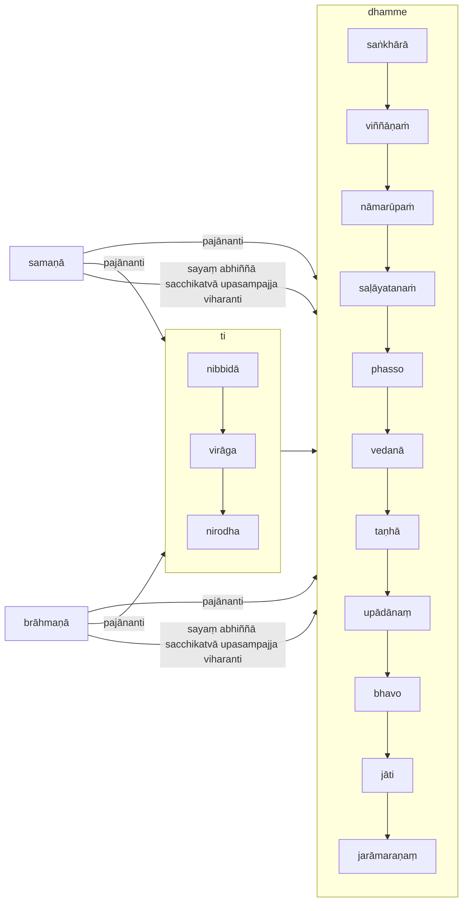

[Home](/) / [12S2 Nidānavaggasaṃyuttapāḷi](../../../12S2.md) / [1 Nidānasaṃyutta](../../1.md) / [1.2 Āhāravagga](../1.2.md)

# 𑀤𑀼𑀢𑀺𑀬𑀲𑀫𑀡𑀩𑁆𑀭𑀸𑀳𑁆𑀫𑀡𑀲𑀼𑀢𑁆𑀢 (1.2.4 Dutiyasamaṇabrāhmaṇasutta)

* 𑀦𑀺𑀤𑀸𑀦𑀲𑀁𑀬𑀼𑀢𑁆𑀢 (Nidānasaṃyutta)

* 𑀆𑀳𑀸𑀭𑀯𑀕𑁆𑀕 (Āhāravagga)

* 𑀤𑀼𑀢𑀺𑀬𑀲𑀫𑀡𑀩𑁆𑀭𑀸𑀳𑁆𑀫𑀡𑀲𑀼𑀢𑁆𑀢 (Dutiyasamaṇabrāhmaṇasutta)

## Summary

This is an expansion of [1.2.3 Samaṇabrāhmaṇasutta](1.2.3.md) that also discusses the characteristics of true samaṇā and brāhmaṇā (religious practitioners, classified as either ascetics or brahmins), who understand dependent origination (the underlying causes of jarāmaraṇaṃ (old age and death), their origin, cessation and path leading to cessation). Those who do not understand these are not considered true samaṇā or brāhmaṇā, however those that do attained and remain in the goal of being a samaṇā or brāhmaṇā, by their own efforts, having personally experienced with direct knowledge.

## Translation

(14.)

83\. 𑀲𑀸𑀯𑀢𑁆𑀣𑀺𑀬𑀁 𑀯𑀺𑀳𑀭𑀢𑀺𑁇 “𑀬𑁂 𑀳𑀺 𑀓𑁂𑀘𑀺, 𑀪𑀺𑀓𑁆𑀔𑀯𑁂, 𑀲𑀫𑀡𑀸 𑀯𑀸 𑀩𑁆𑀭𑀸𑀳𑁆𑀫𑀡𑀸 𑀯𑀸 𑀇𑀫𑁂 𑀥𑀫𑁆𑀫𑁂 𑀦𑀧𑁆𑀧𑀚𑀸𑀦𑀦𑁆𑀢𑀺, 𑀇𑀫𑁂𑀲𑀁 𑀥𑀫𑁆𑀫𑀸𑀦𑀁 𑀲𑀫𑀼𑀤𑀬𑀁 𑀦𑀧𑁆𑀧𑀚𑀸𑀦𑀦𑁆𑀢𑀺, 𑀇𑀫𑁂𑀲𑀁 𑀥𑀫𑁆𑀫𑀸𑀦𑀁 𑀦𑀺𑀭𑁄𑀥𑀁 𑀦𑀧𑁆𑀧𑀚𑀸𑀦𑀦𑁆𑀢𑀺, 𑀇𑀫𑁂𑀲𑀁 𑀥𑀫𑁆𑀫𑀸𑀦𑀁 𑀦𑀺𑀭𑁄𑀥𑀕𑀸𑀫𑀺𑀦𑀺𑀁 𑀧𑀝𑀺𑀧𑀤𑀁 𑀦𑀧𑁆𑀧𑀚𑀸𑀦𑀦𑁆𑀢𑀺, 𑀓𑀢𑀫𑁂 𑀥𑀫𑁆𑀫𑁂 𑀦𑀧𑁆𑀧𑀚𑀸𑀦𑀦𑁆𑀢𑀺, 𑀓𑀢𑀫𑁂𑀲𑀁 𑀥𑀫𑁆𑀫𑀸𑀦𑀁 𑀲𑀫𑀼𑀤𑀬𑀁 𑀦𑀧𑁆𑀧𑀚𑀸𑀦𑀦𑁆𑀢𑀺, 𑀓𑀢𑀫𑁂𑀲𑀁 𑀥𑀫𑁆𑀫𑀸𑀦𑀁 𑀦𑀺𑀭𑁄𑀥𑀁 𑀦𑀧𑁆𑀧𑀚𑀸𑀦𑀦𑁆𑀢𑀺, 𑀓𑀢𑀫𑁂𑀲𑀁 𑀥𑀫𑁆𑀫𑀸𑀦𑀁 𑀦𑀺𑀭𑁄𑀥𑀕𑀸𑀫𑀺𑀦𑀺𑀁 𑀧𑀝𑀺𑀧𑀤𑀁 𑀦𑀧𑁆𑀧𑀚𑀸𑀦𑀦𑁆𑀢𑀺?

> (Whilst residing at Sāvatthi.) 'Whoever samaṇā or brāhmaṇā (religious practitioners), bhikhave:
>
> * do not pajānanti (understand) these dhamme (constructs),
> * do not understand the samudayaṃ (origin) of these dhamme,
> * do not understand the nirodhaṃ (cessation) of these dhamme,
> * do not understand nirodhagāminiṃ paṭipadaṃ (the path leading to the cessation) of these dhamme,
>
> then:
>
> * what dhamme do they not understand,
> * what dhamme do they not understand the origin of,
> * what dhamme do they not understand the cessation of,
> * what dhamme do they not understand the path leading to the cessation of?

84\. 𑀚𑀭𑀸𑀫𑀭𑀡𑀁 𑀦𑀧𑁆𑀧𑀚𑀸𑀦𑀦𑁆𑀢𑀺, 𑀚𑀭𑀸𑀫𑀭𑀡𑀲𑀫𑀼𑀤𑀬𑀁 𑀦𑀧𑁆𑀧𑀚𑀸𑀦𑀦𑁆𑀢𑀺, 𑀚𑀭𑀸𑀫𑀭𑀡𑀦𑀺𑀭𑁄𑀥𑀁 𑀦𑀧𑁆𑀧𑀚𑀸𑀦𑀦𑁆𑀢𑀺, 𑀚𑀭𑀸𑀫𑀭𑀡𑀦𑀺𑀭𑁄𑀥𑀕𑀸𑀫𑀺𑀦𑀺𑀁 𑀧𑀝𑀺𑀧𑀤𑀁 𑀦𑀧𑁆𑀧𑀚𑀸𑀦𑀦𑁆𑀢𑀺; 𑀚𑀸𑀢𑀺𑀁…𑀧𑁂…  𑀪𑀯𑀁…  𑀉𑀧𑀸𑀤𑀸𑀦𑀁…  𑀢𑀡𑁆𑀳𑀁…  𑀯𑁂𑀤𑀦𑀁…  𑀨𑀲𑁆𑀲𑀁…  𑀲𑀍𑀆𑀬𑀢𑀦𑀁…  𑀦𑀸𑀫𑀭𑀽𑀧𑀁…  𑀯𑀺𑀜𑁆𑀜𑀸𑀡𑀁…  𑀲𑀗𑁆𑀔𑀸𑀭𑁂 𑀦𑀧𑁆𑀧𑀚𑀸𑀦𑀦𑁆𑀢𑀺, 𑀲𑀗𑁆𑀔𑀸𑀭𑀲𑀫𑀼𑀤𑀬𑀁 𑀦𑀧𑁆𑀧𑀚𑀸𑀦𑀦𑁆𑀢𑀺, 𑀲𑀗𑁆𑀔𑀸𑀭𑀦𑀺𑀭𑁄𑀥𑀁 𑀦𑀧𑁆𑀧𑀚𑀸𑀦𑀦𑁆𑀢𑀺, 𑀲𑀗𑁆𑀔𑀸𑀭𑀦𑀺𑀭𑁄𑀥𑀕𑀸𑀫𑀺𑀦𑀺𑀁 𑀧𑀝𑀺𑀧𑀤𑀁 𑀦𑀧𑁆𑀧𑀚𑀸𑀦𑀦𑁆𑀢𑀺𑁇 𑀇𑀫𑁂 𑀥𑀫𑁆𑀫𑁂 𑀦𑀧𑁆𑀧𑀚𑀸𑀦𑀦𑁆𑀢𑀺, 𑀇𑀫𑁂𑀲𑀁 𑀥𑀫𑁆𑀫𑀸𑀦𑀁 𑀲𑀫𑀼𑀤𑀬𑀁 𑀦𑀧𑁆𑀧𑀚𑀸𑀦𑀦𑁆𑀢𑀺, 𑀇𑀫𑁂𑀲𑀁 𑀥𑀫𑁆𑀫𑀸𑀦𑀁 𑀦𑀺𑀭𑁄𑀥𑀁 𑀦𑀧𑁆𑀧𑀚𑀸𑀦𑀦𑁆𑀢𑀺, 𑀇𑀫𑁂𑀲𑀁 𑀥𑀫𑁆𑀫𑀸𑀦𑀁 𑀦𑀺𑀭𑁄𑀥𑀕𑀸𑀫𑀺𑀦𑀺𑀁 𑀧𑀝𑀺𑀧𑀤𑀁 𑀦𑀧𑁆𑀧𑀚𑀸𑀦𑀦𑁆𑀢𑀺𑁇 𑀦 𑀫𑁂 𑀢𑁂, 𑀪𑀺𑀓𑁆𑀔𑀯𑁂, 𑀲𑀫𑀡𑀸 𑀯𑀸 𑀩𑁆𑀭𑀸𑀳𑁆𑀫𑀡𑀸 𑀯𑀸 𑀲𑀫𑀡𑁂𑀲𑀼 𑀯𑀸 𑀲𑀫𑀡𑀲𑀫𑁆𑀫𑀢𑀸 𑀩𑁆𑀭𑀸𑀳𑁆𑀫𑀡𑁂𑀲𑀼 𑀯𑀸 𑀩𑁆𑀭𑀸𑀳𑁆𑀫𑀡𑀲𑀫𑁆𑀫𑀢𑀸, 𑀦 𑀘 𑀧𑀦 𑀢𑁂 𑀆𑀬𑀲𑁆𑀫𑀦𑁆𑀢𑁄 𑀲𑀸𑀫𑀜𑁆𑀜𑀢𑁆𑀣𑀁 𑀯𑀸 𑀩𑁆𑀭𑀳𑁆𑀫𑀜𑁆𑀜𑀢𑁆𑀣𑀁 𑀯𑀸 𑀤𑀺𑀝𑁆𑀞𑁂𑀯 𑀥𑀫𑁆𑀫𑁂 𑀲𑀬𑀁 𑀅𑀪𑀺𑀜𑁆𑀜𑀸 𑀲𑀘𑁆𑀙𑀺𑀓𑀢𑁆𑀯𑀸 𑀉𑀧𑀲𑀫𑁆𑀧𑀚𑁆𑀚 𑀯𑀺𑀳𑀭𑀦𑁆𑀢𑀺𑁇

> * They do not understand jarāmaraṇaṃ (old age and death),
> * they do not understand the origin of jarāmaraṇaṃ,
> * they do not understand the cessation of jarāmaraṇaṃ,
> * they do not understand the path leading to the cessation of jarāmaraṇaṃ;
> * jāti (birth) …
> * bhavo (existence) …
> * upādānaṃ (fuel, or attachments) …
> * taṇhā (craving) …
> * vedanā (feelings) …
> * phasso (experience of stimuli) …
> * saḷāyatanaṁ (six senses) …
> * nāmarūpaṁ (identity and form) …
> * viññāṇaṁ (consciousness) …
> * they do not understand saṅkhārā (mental constructions),
> * they do not understand the origin of saṅkhārā,
> * they do not understand the cessation of saṅkhārā,
> * they do not understand the path leading to the cessation of saṅkhārā.
>
> These dhamme:
>
> * they do not understand,
> * they do not understand the origin of these dhamme,
> * they do not understand the cessation of these dhamme,
> * they do not understand the path leading to the cessation of these dhamme.
>
> Indeed, in my opinion, those samaṇā or brāhmaṇā are not true samaṇā among samaṇā or true brāhmaṇā among brāhmaṇā, and moreover without these dhamme  (teachings or truths), they have not attained and remained in the goal of being a samaṇā or brāhmaṇā, by sayaṃ (their own efforts), sacchikatvā (having personal experienced) and abhiññā (with direct knowledge).

85\. 𑀬𑁂 𑀘 𑀔𑁄 𑀓𑁂𑀘𑀺, 𑀪𑀺𑀓𑁆𑀔𑀯𑁂, 𑀲𑀫𑀡𑀸 𑀯𑀸 𑀩𑁆𑀭𑀸𑀳𑁆𑀫𑀡𑀸 𑀯𑀸 𑀇𑀫𑁂 𑀥𑀫𑁆𑀫𑁂 𑀧𑀚𑀸𑀦𑀦𑁆𑀢𑀺, 𑀇𑀫𑁂𑀲𑀁 𑀥𑀫𑁆𑀫𑀸𑀦𑀁 𑀲𑀫𑀼𑀤𑀬𑀁 𑀧𑀚𑀸𑀦𑀦𑁆𑀢𑀺, 𑀇𑀫𑁂𑀲𑀁 𑀥𑀫𑁆𑀫𑀸𑀦𑀁 𑀦𑀺𑀭𑁄𑀥𑀁 𑀧𑀚𑀸𑀦𑀦𑁆𑀢𑀺, 𑀇𑀫𑁂𑀲𑀁 𑀥𑀫𑁆𑀫𑀸𑀦𑀁 𑀦𑀺𑀭𑁄𑀥𑀕𑀸𑀫𑀺𑀦𑀺𑀁 𑀧𑀝𑀺𑀧𑀤𑀁 𑀧𑀚𑀸𑀦𑀦𑁆𑀢𑀺, 𑀓𑀢𑀫𑁂 𑀥𑀫𑁆𑀫𑁂 𑀧𑀚𑀸𑀦𑀦𑁆𑀢𑀺, 𑀓𑀢𑀫𑁂𑀲𑀁 𑀥𑀫𑁆𑀫𑀸𑀦𑀁 𑀲𑀫𑀼𑀤𑀬𑀁 𑀧𑀚𑀸𑀦𑀦𑁆𑀢𑀺, 𑀓𑀢𑀫𑁂𑀲𑀁 𑀥𑀫𑁆𑀫𑀸𑀦𑀁 𑀦𑀺𑀭𑁄𑀥𑀁 𑀧𑀚𑀸𑀦𑀦𑁆𑀢𑀺, 𑀓𑀢𑀫𑁂𑀲𑀁 𑀥𑀫𑁆𑀫𑀸𑀦𑀁 𑀦𑀺𑀭𑁄𑀥𑀕𑀸𑀫𑀺𑀦𑀺𑀁 𑀧𑀝𑀺𑀧𑀤𑀁 𑀧𑀚𑀸𑀦𑀦𑁆𑀢𑀺?

> Whoever samaṇā or brāhmaṇā, bhikhave,
>
> * understand these dhamme,
> * understand the origin of these dhamme,
> * understand the cessation of these dhamme,
> * understand the path leading to the cessation of these dhamme
>
> then:
>
> * what dhamme do they understand,
> what dhamme do they understand the origin of,
> what dhamme do they understand the cessation of,
> what dhamme do they understand the path leading to the cessation of?

86\. 𑀚𑀭𑀸𑀫𑀭𑀡𑀁 𑀧𑀚𑀸𑀦𑀦𑁆𑀢𑀺, 𑀚𑀭𑀸𑀫𑀭𑀡𑀲𑀫𑀼𑀤𑀬𑀁 𑀧𑀚𑀸𑀦𑀦𑁆𑀢𑀺, 𑀚𑀭𑀸𑀫𑀭𑀡𑀦𑀺𑀭𑁄𑀥𑀁 𑀧𑀚𑀸𑀦𑀦𑁆𑀢𑀺, 𑀚𑀭𑀸𑀫𑀭𑀡𑀦𑀺𑀭𑁄𑀥𑀕𑀸𑀫𑀺𑀦𑀺𑀁 𑀧𑀝𑀺𑀧𑀤𑀁 𑀧𑀚𑀸𑀦𑀦𑁆𑀢𑀺; 𑀚𑀸𑀢𑀺𑀁…𑀧𑁂…  𑀪𑀯𑀁…  𑀉𑀧𑀸𑀤𑀸𑀦𑀁…  𑀢𑀡𑁆𑀳𑀁…  𑀯𑁂𑀤𑀦𑀁…  𑀨𑀲𑁆𑀲𑀁…  𑀲𑀍𑀆𑀬𑀢𑀦𑀁…  𑀦𑀸𑀫𑀭𑀽𑀧𑀁…  𑀯𑀺𑀜𑁆𑀜𑀸𑀡𑀁…  𑀲𑀗𑁆𑀔𑀸𑀭𑁂 𑀧𑀚𑀸𑀦𑀦𑁆𑀢𑀺, 𑀲𑀗𑁆𑀔𑀸𑀭𑀲𑀫𑀼𑀤𑀬𑀁 𑀧𑀚𑀸𑀦𑀦𑁆𑀢𑀺, 𑀲𑀗𑁆𑀔𑀸𑀭𑀦𑀺𑀭𑁄𑀥𑀁 𑀧𑀚𑀸𑀦𑀦𑁆𑀢𑀺, 𑀲𑀗𑁆𑀔𑀸𑀭𑀦𑀺𑀭𑁄𑀥𑀕𑀸𑀫𑀺𑀦𑀺𑀁 𑀧𑀝𑀺𑀧𑀤𑀁 𑀧𑀚𑀸𑀦𑀦𑁆𑀢𑀺𑁇 𑀇𑀫𑁂 𑀥𑀫𑁆𑀫𑁂 𑀧𑀚𑀸𑀦𑀦𑁆𑀢𑀺, 𑀇𑀫𑁂𑀲𑀁 𑀥𑀫𑁆𑀫𑀸𑀦𑀁 𑀲𑀫𑀼𑀤𑀬𑀁 𑀧𑀚𑀸𑀦𑀦𑁆𑀢𑀺, 𑀇𑀫𑁂𑀲𑀁 𑀥𑀫𑁆𑀫𑀸𑀦𑀁 𑀦𑀺𑀭𑁄𑀥𑀁 𑀧𑀚𑀸𑀦𑀦𑁆𑀢𑀺, 𑀇𑀫𑁂𑀲𑀁 𑀥𑀫𑁆𑀫𑀸𑀦𑀁 𑀦𑀺𑀭𑁄𑀥𑀕𑀸𑀫𑀺𑀦𑀺𑀁 𑀧𑀝𑀺𑀧𑀤𑀁 𑀧𑀚𑀸𑀦𑀦𑁆𑀢𑀺𑁇 𑀢𑁂 𑀔𑁄 𑀫𑁂, 𑀪𑀺𑀓𑁆𑀔𑀯𑁂, 𑀲𑀫𑀡𑀸 𑀯𑀸 𑀩𑁆𑀭𑀸𑀳𑁆𑀫𑀡𑀸 𑀯𑀸 𑀲𑀫𑀡𑁂𑀲𑀼 𑀘𑁂𑀯 𑀲𑀫𑀡𑀲𑀫𑁆𑀫𑀢𑀸, 𑀩𑁆𑀭𑀸𑀳𑁆𑀫𑀡𑁂𑀲𑀼 𑀘 𑀩𑁆𑀭𑀸𑀳𑁆𑀫𑀡𑀲𑀫𑁆𑀫𑀢𑀸𑁇 𑀢𑁂 𑀘 𑀧𑀦𑀸𑀬𑀲𑁆𑀫𑀦𑁆𑀢𑁄 𑀲𑀸𑀫𑀜𑁆𑀜𑀢𑁆𑀣𑀜𑁆𑀘 𑀩𑁆𑀭𑀳𑁆𑀫𑀜𑁆𑀜𑀢𑁆𑀣𑀜𑁆𑀘 𑀤𑀺𑀝𑁆𑀞𑁂𑀯 𑀥𑀫𑁆𑀫𑁂 𑀲𑀬𑀁 𑀅𑀪𑀺𑀜𑁆𑀜𑀸 𑀲𑀘𑁆𑀙𑀺𑀓𑀢𑁆𑀯𑀸 𑀉𑀧𑀲𑀫𑁆𑀧𑀚𑁆𑀚 𑀯𑀺𑀳𑀭𑀦𑁆𑀢𑀻”𑀢𑀺𑁇

> * They understand jarāmaraṇaṃ,
> * they understand the origin of jarāmaraṇaṃ,
> * they understand the cessation of jarāmaraṇaṃ,
> * they understand the path leading to the cessation of jarāmaraṇaṃ;
> * jāti…
> * bhavo…
> * upādānaṃ…
> * taṇhā…
> * vedanā…
> * phasso…
> * saḷāyatanaṁ…
> * viññāṇaṁ…
> * they understand saṅkhārā,
> * they understand the origin of saṅkhārā,
> * they understand the cessation of saṅkhārā,
> * they understand the path leading to the cessation of saṅkhārā.
>
> These dhamme:
>
> * they understand,
> * they understand the origin of these dhamme,
> * they understand the cessation of these dhamme,
> * they understand the path leading to the cessation of these dhamme.
>
> Indeed, by my opinion, bhikkhave, those samaṇā or brāhmaṇā are true samaṇā amongst samaṇā and true brāhmaṇā amongst brāhmaṇā. And those āyasmanto, with these teachings or truths, have attained and remain in the goal of being a samaṇā or brāhmaṇā, by their own efforts, having personally experienced with direct knowledge.

## Commentary

This is an alternate formulation of [1.2.3 Samaṇabrāhmaṇasutta](1.2.3.md).

---

87\. 𑀘𑀢𑀼𑀢𑁆𑀣𑀁𑁇 (Fourth)

[Go to previous page (1.2.3 Samaṇabrāhmaṇasutta)](1.2.3.md) / [Go to parent page (1.2 Āhāravagga)](../1.2.md) / [Go to next page (1.2.5 Kaccānagottasutta)](1.2.5.md)
