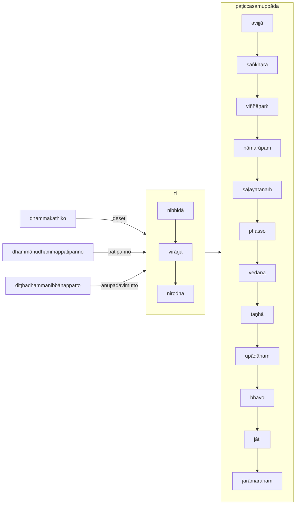

[Home](/) / [12S2 Nidānavaggasaṃyuttapāḷi](../../../12S2.md) / [1 Nidānasaṃyutta](../../1.md) / [1.2 Āhāravagga](../1.2.md)

# 𑀥𑀫𑁆𑀫𑀓𑀣𑀺𑀓𑀲𑀼𑀢𑁆𑀢 (1.2.6 Dhammakathikasutta)

* 𑀦𑀺𑀤𑀸𑀦𑀲𑀁𑀬𑀼𑀢𑁆𑀢 (Nidānasaṃyutta)

* 𑀆𑀳𑀸𑀭𑀯𑀕𑁆𑀕 (Āhāravagga)

* 𑀥𑀫𑁆𑀫𑀓𑀣𑀺𑀓𑀲𑀼𑀢𑁆𑀢 (Dhammakathikasutta)

## Summary

Dhammakathikasutta discusses the meaning of a dhammakathiko (Dhamma teacher), and related terms such as dhammānudhammappaṭipanno (Dhamma practitioner) and diṭṭhadhammanibbānappatto (Dhamma achiever).

## Translation

(16.)

92\. 𑀲𑀸𑀯𑀢𑁆𑀣𑀺𑀬𑀁…  𑀅𑀣 𑀔𑁄 𑀅𑀜𑁆𑀜𑀢𑀭𑁄 𑀪𑀺𑀓𑁆𑀔𑀼 𑀬𑁂𑀦 𑀪𑀕𑀯𑀸 𑀢𑁂𑀦𑀼𑀧𑀲𑀗𑁆𑀓𑀫𑀺; 𑀉𑀧𑀲𑀗𑁆𑀓𑀫𑀺𑀢𑁆𑀯𑀸 𑀪𑀕𑀯𑀦𑁆𑀢𑀁 𑀅𑀪𑀺𑀯𑀸𑀤𑁂𑀢𑁆𑀯𑀸 𑀏𑀓𑀫𑀦𑁆𑀢𑀁 𑀦𑀺𑀲𑀻𑀤𑀺𑁇 𑀏𑀓𑀫𑀦𑁆𑀢𑀁 𑀦𑀺𑀲𑀺𑀦𑁆𑀦𑁄 𑀔𑁄 𑀲𑁄 𑀪𑀺𑀓𑁆𑀔𑀼 𑀪𑀕𑀯𑀦𑁆𑀢𑀁 𑀏𑀢𑀤𑀯𑁄𑀘—  “‘𑀥𑀫𑁆𑀫𑀓𑀣𑀺𑀓𑁄 𑀥𑀫𑁆𑀫𑀓𑀣𑀺𑀓𑁄’𑀢𑀺, 𑀪𑀦𑁆𑀢𑁂, 𑀯𑀼𑀘𑁆𑀘𑀢𑀺𑁇 𑀓𑀺𑀢𑁆𑀢𑀸𑀯𑀢𑀸 𑀦𑀼 𑀔𑁄, 𑀪𑀦𑁆𑀢𑁂, 𑀥𑀫𑁆𑀫𑀓𑀣𑀺𑀓𑁄 𑀳𑁄𑀢𑀻”𑀢𑀺?

> (At Sāvatthi…)  Then a certain bhikkhu approached where the Bhagavā is. Having approached, having paid respects to the Bhagavā, he sat down on one side.  Seated on one side, that bhikkhu said to the Bhagavā—  “‘Dhammakathiko (Dhamma teacher), dhammakathiko,’ Bhante, it is said.  In what respect is 'dhammakathiko', Bhante?”

93\. “𑀚𑀭𑀸𑀫𑀭𑀡𑀲𑁆𑀲 𑀘𑁂 𑀪𑀺𑀓𑁆𑀔𑀼 𑀦𑀺𑀩𑁆𑀩𑀺𑀤𑀸𑀬 𑀯𑀺𑀭𑀸𑀕𑀸𑀬 𑀦𑀺𑀭𑁄𑀥𑀸𑀬 𑀥𑀫𑁆𑀫𑀁 𑀤𑁂𑀲𑁂𑀢𑀺, ‘𑀥𑀫𑁆𑀫𑀓𑀣𑀺𑀓𑁄 𑀪𑀺𑀓𑁆𑀔𑀽’𑀢𑀺 𑀅𑀮𑀁𑀯𑀘𑀦𑀸𑀬𑁇 𑀚𑀭𑀸𑀫𑀭𑀡𑀲𑁆𑀲 𑀘𑁂 𑀪𑀺𑀓𑁆𑀔𑀼 𑀦𑀺𑀩𑁆𑀩𑀺𑀤𑀸𑀬 𑀯𑀺𑀭𑀸𑀕𑀸𑀬 𑀦𑀺𑀭𑁄𑀥𑀸𑀬 𑀧𑀝𑀺𑀧𑀦𑁆𑀦𑁄 𑀳𑁄𑀢𑀺, ‘𑀥𑀫𑁆𑀫𑀸𑀦𑀼𑀥𑀫𑁆𑀫𑀧𑁆𑀧𑀝𑀺𑀧𑀦𑁆𑀦𑁄 𑀪𑀺𑀓𑁆𑀔𑀽’𑀢𑀺 𑀅𑀮𑀁𑀯𑀘𑀦𑀸𑀬𑁇 𑀚𑀭𑀸𑀫𑀭𑀡𑀲𑁆𑀲 𑀘𑁂 𑀪𑀺𑀓𑁆𑀔𑀼 𑀦𑀺𑀩𑁆𑀩𑀺𑀤𑀸 𑀯𑀺𑀭𑀸𑀕𑀸 𑀦𑀺𑀭𑁄𑀥𑀸 𑀅𑀦𑀼𑀧𑀸𑀤𑀸𑀯𑀺𑀫𑀼𑀢𑁆𑀢𑁄 𑀳𑁄𑀢𑀺, ‘𑀤𑀺𑀝𑁆𑀞𑀥𑀫𑁆𑀫𑀦𑀺𑀩𑁆𑀩𑀸𑀦𑀧𑁆𑀧𑀢𑁆𑀢𑁄 𑀪𑀺𑀓𑁆𑀔𑀽’𑀢𑀺 𑀅𑀮𑀁𑀯𑀘𑀦𑀸𑀬𑁇

> “If a bhikkhu teaches the Dhamma for the nibbidā (disinterest), virāga (detachment), and nirodha (cessation) of jarāmaraṇaṃ, ‘dhammakathiko bhikkhu’ is an appropriate term.  If a bhikkhu practices for the nibbidā, virāga, and nirodha of jarāmaraṇaṃ, ‘dhammānudhammappaṭipanno (one who is practising the Dhamma in line with the teaching) bhikkhu’ is an appropriate term.  If a bhikkhu, having achieved nibbidā, virāga, and nirodha of jarāmaraṇaṃ, is lanupādāvimutto (iberated through non-attachment), ‘diṭṭhadhammanibbānappatto (one who has understood the Dhamma and achieved extinguishment) bhikkhu’ is an appropriate term.

94\. 𑀚𑀸𑀢𑀺𑀬𑀸 𑀘𑁂 𑀪𑀺𑀓𑁆𑀔𑀼…𑀧𑁂…  𑀪𑀯𑀲𑁆𑀲 𑀘𑁂 𑀪𑀺𑀓𑁆𑀔𑀼…  𑀉𑀧𑀸𑀤𑀸𑀦𑀲𑁆𑀲 𑀘𑁂 𑀪𑀺𑀓𑁆𑀔𑀼…  𑀢𑀡𑁆𑀳𑀸𑀬 𑀘𑁂 𑀪𑀺𑀓𑁆𑀔𑀼…  𑀯𑁂𑀤𑀦𑀸𑀬 𑀘𑁂 𑀪𑀺𑀓𑁆𑀔𑀼…  𑀨𑀲𑁆𑀲𑀲𑁆𑀲 𑀘𑁂 𑀪𑀺𑀓𑁆𑀔𑀼…  𑀲𑀍𑀆𑀬𑀢𑀦𑀲𑁆𑀲 𑀘𑁂 𑀪𑀺𑀓𑁆𑀔𑀼…  𑀦𑀸𑀫𑀭𑀽𑀧𑀲𑁆𑀲 𑀘𑁂 𑀪𑀺𑀓𑁆𑀔𑀼…  𑀯𑀺𑀜𑁆𑀜𑀸𑀡𑀲𑁆𑀲 𑀘𑁂 𑀪𑀺𑀓𑁆𑀔𑀼…  𑀲𑀗𑁆𑀔𑀸𑀭𑀸𑀦𑀜𑁆𑀘𑁂 𑀪𑀺𑀓𑁆𑀔𑀼…  𑀅𑀯𑀺𑀚𑁆𑀚𑀸𑀬 𑀘𑁂 𑀪𑀺𑀓𑁆𑀔𑀼 𑀦𑀺𑀩𑁆𑀩𑀺𑀤𑀸𑀬 𑀯𑀺𑀭𑀸𑀕𑀸𑀬 𑀦𑀺𑀭𑁄𑀥𑀸𑀬 𑀥𑀫𑁆𑀫𑀁 𑀤𑁂𑀲𑁂𑀢𑀺, ‘𑀥𑀫𑁆𑀫𑀓𑀣𑀺𑀓𑁄 𑀪𑀺𑀓𑁆𑀔𑀽’𑀢𑀺 𑀅𑀮𑀁𑀯𑀘𑀦𑀸𑀬𑁇 𑀅𑀯𑀺𑀚𑁆𑀚𑀸𑀬 𑀘𑁂 𑀪𑀺𑀓𑁆𑀔𑀼 𑀦𑀺𑀩𑁆𑀩𑀺𑀤𑀸𑀬 𑀯𑀺𑀭𑀸𑀕𑀸𑀬 𑀦𑀺𑀭𑁄𑀥𑀸𑀬 𑀧𑀝𑀺𑀧𑀦𑁆𑀦𑁄 𑀳𑁄𑀢𑀺, ‘𑀥𑀫𑁆𑀫𑀸𑀦𑀼𑀥𑀫𑁆𑀫𑀧𑁆𑀧𑀝𑀺𑀧𑀦𑁆𑀦𑁄 𑀪𑀺𑀓𑁆𑀔𑀽’𑀢𑀺 𑀅𑀮𑀁𑀯𑀘𑀦𑀸𑀬𑁇 𑀅𑀯𑀺𑀚𑁆𑀚𑀸𑀬 𑀘𑁂 𑀪𑀺𑀓𑁆𑀔𑀼 𑀦𑀺𑀩𑁆𑀩𑀺𑀤𑀸 𑀯𑀺𑀭𑀸𑀕𑀸 𑀦𑀺𑀭𑁄𑀥𑀸 𑀅𑀦𑀼𑀧𑀸𑀤𑀸𑀯𑀺𑀫𑀼𑀢𑁆𑀢𑁄 𑀳𑁄𑀢𑀺, ‘𑀤𑀺𑀝𑁆𑀞𑀥𑀫𑁆𑀫𑀦𑀺𑀩𑁆𑀩𑀸𑀦𑀧𑁆𑀧𑀢𑁆𑀢𑁄 𑀪𑀺𑀓𑁆𑀔𑀽’𑀢𑀺 𑀅𑀮𑀁𑀯𑀘𑀦𑀸𑀬𑀸”𑀢𑀺𑁇

> If a bhikkhu (teaches the Dhamma for the nibbidā, virāga, and nirodha) of jāti…  of bhavo…  of upādānaṃ…  of taṇhā…  of vedanā…  of phasso…  of saḷāyatanaṁ…  of viññāṇaṁ…  of saṅkhārā…  of avijjā, ‘a dhammakathiko bhikkhu’ is an appropriate term.  If a bhikkhu practices for the nibbidā, virāga, and nirodha of avijjā, ‘dhammānudhammappaṭipanno (one who is practising the Dhamma in line with the teaching) bhikkhu’ is an appropriate term.  If a bhikkhu, having achieved nibbidā, virāga, and nirodha of avijjā, is lanupādāvimutto (iberated through non-attachment), ‘diṭṭhadhammanibbānappatto (one who has understood the Dhamma and achieved extinguishment) bhikkhu’ is an appropriate term.

## Commentary

This commentary is another variation of dependent origination, where the Buddha proclaims that a "Dhamma teacher, practitioner, achiever" is one who teaches, practices and have achieved the disinterest, detachment, and cessation of each of the underlying causes of dependent origination.

---

95\. 𑀙𑀝𑁆𑀞𑀁𑁇 (Sixth)

[Go to previous page (1.2.5 Kaccānagottasutta)](1.2.5.md) / [Go to parent page (1.2 Āhāravagga)](../1.2.md) / [Go to next page (1.2.7 Acelakassapasutta)](1.2.7.md)
